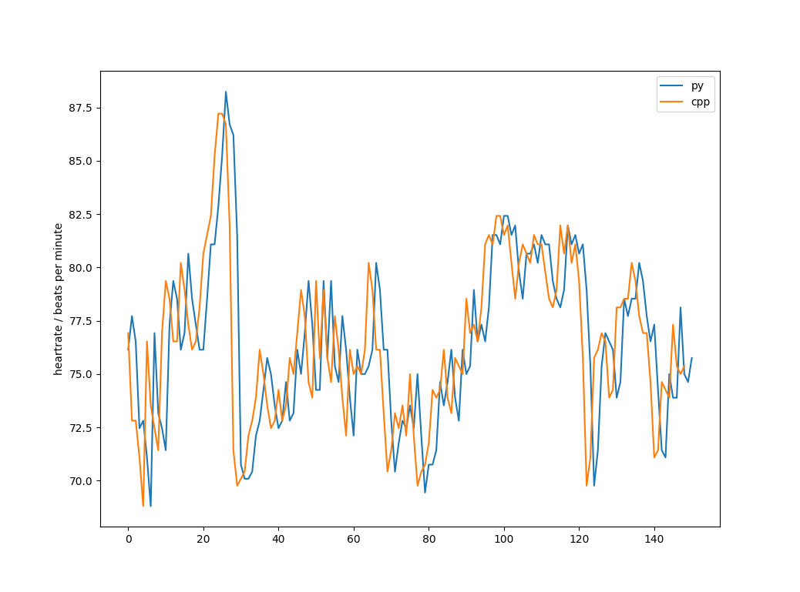

# Two Moving Average QRS detector

C++ implementation of: 
        Elgendi, Mohamed & Jonkman, 
        Mirjam & De Boer, Friso. (2010).
        Frequency Bands Effects on QRS Detection.
        The 3rd International Conference on Bio-inspired Systems 
        and Signal Processing (BIOSIGNALS2010). 428-431.

## Usage

The detector is header-only:
```
include "two_avg_qrs_det.h"
```

Create a QRS callback:

```
struct MyCallback : HRCallback {
        virtual void hasQRS(long int sampleNo) {
		// do something with the detection
        }
};

```

Create an instance of the detector:

```
TwoMovingAverageQRSdetector twoavg(fs);
```
with `fs` being the sampling rate.


Register the callback:

```
twoavg.registerCallback(&callback);
```

And then in your realtime application feed the ECG sample by sample into the detector:

```
twoavg.detect(a);
```

The callback is then called whenever there is a QRS detected.


## Demo

Install the IIR filter library (https://github.com/berndporr/iir1)
which is used to remove the mains interference.

Run:
```
cmake .
make
./demo
```
and it will print the heartrate from an example ECG and
save it to `hr.dat` which can be plotted for example
gnuplot or the script `plot_hr.py`.

If you have the python detector installed then you can
compare its output with that from this detector:
`compare_cpp_and_python_detector.py`



# Credit

Bernd Porr
